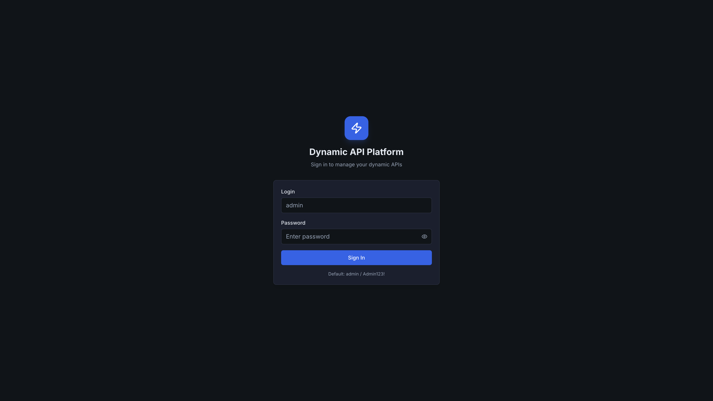
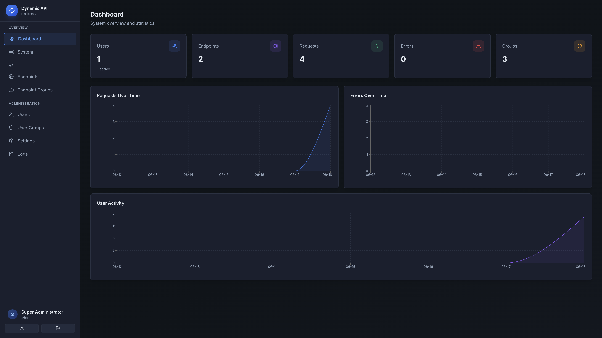
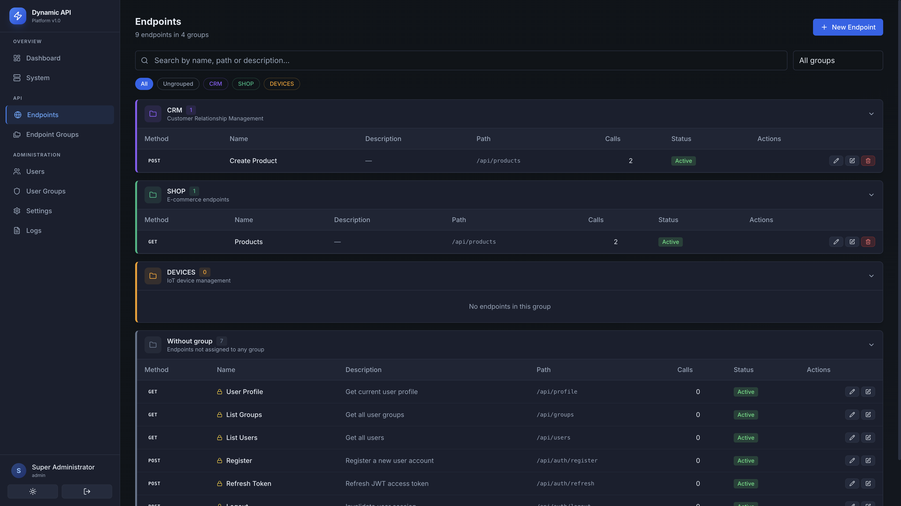
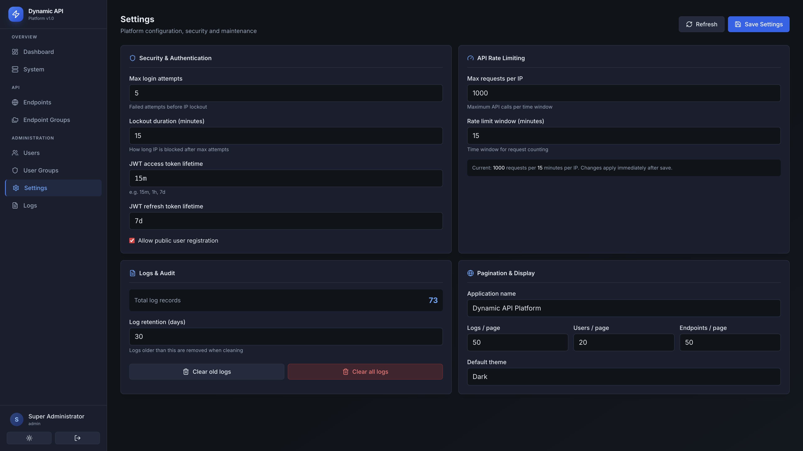
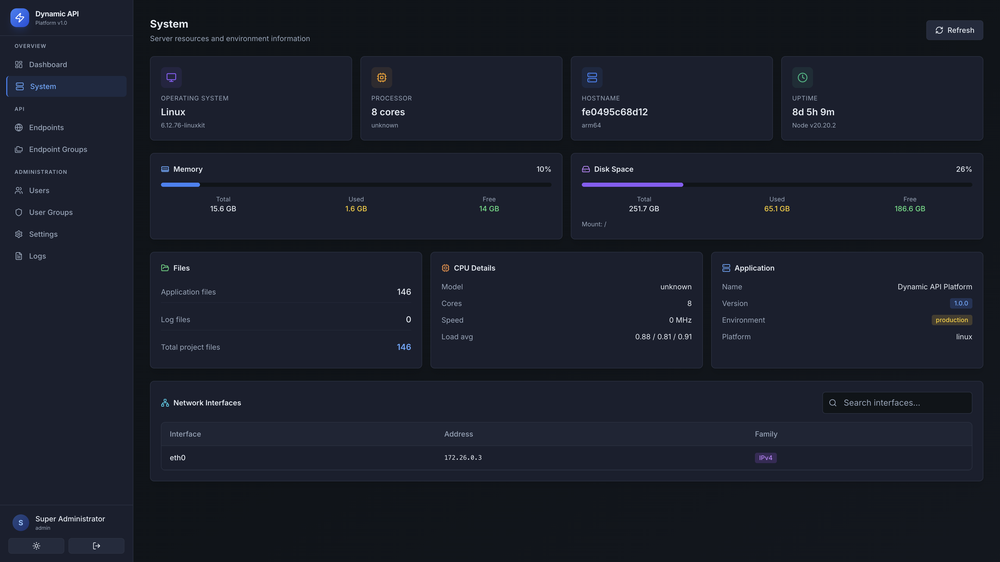

# Screenshots

Скриншоты интерфейса **Dynamic API Platform v1.0**, снятые с локального окружения (`http://localhost:8080`).

> Все изображения находятся в папке [`docs/screenshots/`](screenshots/).

---

## Login

Страница входа в админ-панель.

**URL:** `/login`  
**Учётные данные по умолчанию:** `admin` / `Admin123!`

---

## Dashboard

Главная страница со статистикой и графиками активности.

**URL:** `/`  
**Содержит:** счётчики Users, Endpoints, Requests, Errors, Groups; графики Requests Over Time, Errors Over Time, User Activity.

---

## Endpoints

Управление API-эндпоинтами с группировкой по секциям, поиском и фильтрами.

**URL:** `/endpoints`  
**Содержит:** поиск, фильтры по группам (CRM, SHOP, DEVICES), сворачиваемые таблицы по группам, системные эндпоинты с иконкой замка.

---

## Settings

Настройки платформы: безопасность, rate limiting, логи, пагинация.

**URL:** `/settings`  
**Содержит:** JWT, блокировка входа, регистрация, лимиты API, очистка логов, настройки отображения.

---

## System

Мониторинг серверных ресурсов и сетевых интерфейсов.

**URL:** `/system`  
**Содержит:** OS, CPU, память, диск, файлы, сеть с поиском по интерфейсам.

---

## Как обновить скриншоты

1. Запустите платформу: `docker compose up -d`
2. Откройте http://localhost:8080
3. Сделайте скриншоты ключевых страниц
4. Сохраните в `docs/screenshots/`
5. Обновите этот файл при изменении UI

---

[← Back to documentation](index.md)
